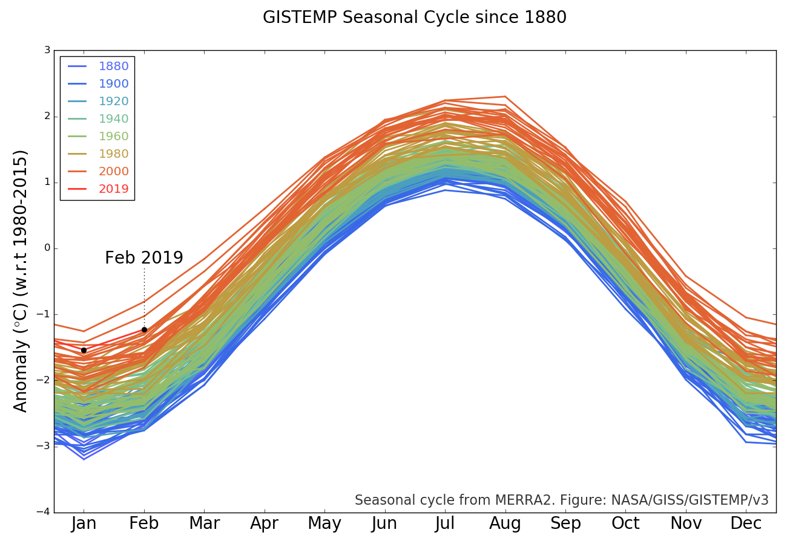
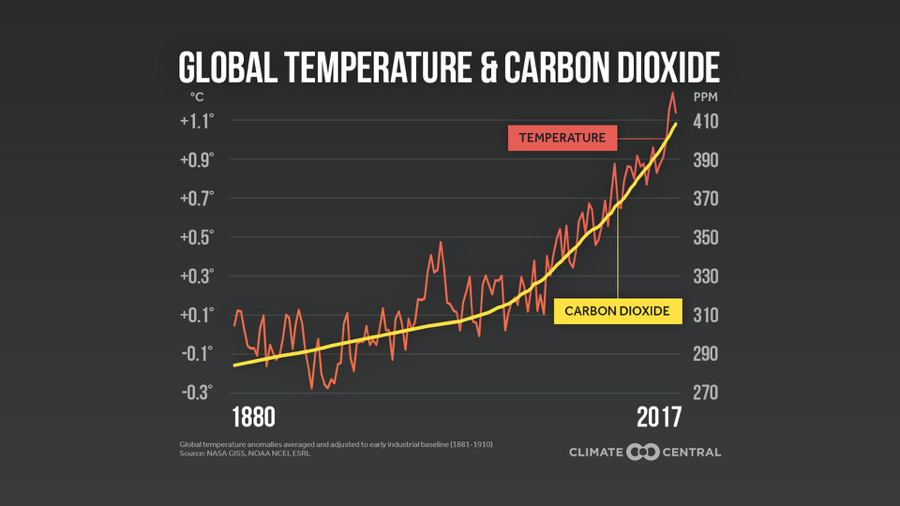
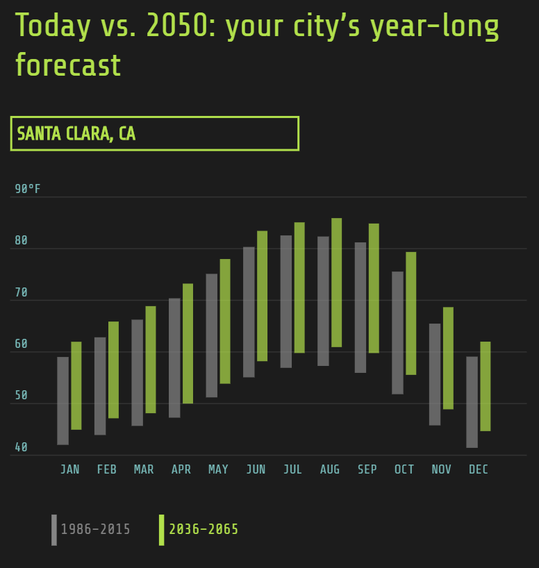

# *1.Visualizations*
The evaluation will be done as follows :
1. Understanding the X and Y co-ordinates. 
2. Description and Interpretation: What underlying theory does the visualisation try to prove.
3. Interesting aspects of the visualisation
4. Improvements expected 
### Visualization 1

<kbd></kbd>

#### Evaluation:

### Visualization 2

<kbd></kbd>

### Visualization 3
<kbd></kbd>

### Visualization 4

<kbd></kbd>

### Visualization 5

# *2.Assessment & Conclusion*
<kbd></kbd>