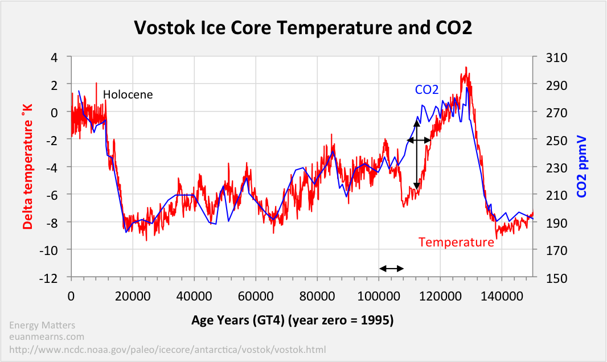

# *1.Visualizations*
The evaluation will be done as follows :
1. Understanding the X and Y co-ordinates. 
2. Interpretation: What underlying theory does the visualisation try to prove.
3. Interesting aspects of the visualisation
4. Suggested improvements 

### Visualization 1

<kbd></kbd>

#### Description and Interpretation:
The visualisation covers the temperature change for 180 countries from the year 1880 to 2017 .The scale of the temperature change ranges from -2.0 Degree Celsius to 2 Degree Celsius depicted in circles for each country individually,the color change from blue to red follows the scale.This suggests that temperature has risen over the years! 
#### Interesting aspects of the visualisation:
This visualisation is multidimensional it tries to convey the effect of **time** on **climate** for many **places**.It tries to build an intuition that temperatures have changed over the time. 
#### Suggested improvements:
It misses out on countries like Belgium and UK which can be added.The visualisation also cannot let us compare the change in temperature in accordance with time,this is more of a con than a suggestion.

### Visualization 2

<kbd></kbd>

#### Understanding the X and Y co-ordinates:
X-axis depicts the months  from January to December.Y-axis again depicts the temperature anomalies ranging from -4 Degree to 3 Degree Celsius(temperature anomaly is the difference between a fixed temperature and the temperature reading of the current timestamp).
#### Interpretation:
The visualisation depicts **seasonal cycle** anomalies since 1880.Each colored line depicts a timeframe (years:-1880,1900,1920,1940,1960,1980,200,2019).It is still noticable that temperatures have risen over the years.
#### Interesting aspects of the visualisation:
Here we can compare the temperature from different time-stamps which the previous visualisation was  incapable of (eg:We can notice that winters were warmer in 2000 than 2019)
#### Suggested improvements:
I would suggest better use of colors so that the lines are distinct and more readable. Use of gradually changing colors and overlapping makes it difficult to interpret the temperature trends (eg:lines orange and red very difficult to interpret individually)

### Visualization 3
<kbd></kbd>

#### Understanding the X and Y co-ordinates:
X-axis depicts the years 1880 to 2017.Y-axis(Left) depicts the temperature anomoly ranging from -0.3 degree Celsius to 1.1 degree Celsius .Y-axis(Left) depicts the content of CO2 in air in PPM(parts per million).
#### Interpretation:
The intent of this graph is to show that rise in temperature(red line) is caused by excessive CO2(yellow line) in the air that humans have caused.CO2 is one of the green house gases that traps heat inside the Earth's atmosphere.
#### Interesting aspects of the visualisation:
This visualisation clearly shows the direct impact of pollution(excessive CO2) on the temperatures in recent human history.
#### Suggested improvements:
X-axis could have some breakpoints instead of no break points, it could have helped identify the time of local maximum temperatures like the one right in the centre.

### Visualization 4

<kbd></kbd>

#### Understanding the X and Y co-ordinates:
X-axis depicts Months .Y-axis depicts temperature in Fahreneit(40 to 90)
#### Interpretation:
This graph tends to depict what will be the **seasonal temperature** in Santa by the year 2050,the grey bar stands for the year 1986-2015 and green bar stands for year 2036-2065. By the intuition of the visualisation it looks that temperatures will increase by 2-3 degree fahreneit . 
#### Interesting aspects of the visualisation:
It tries to dive into the future and cover many dimensions like time in years and months and temperature in fahreneits.It also give a clear comparison between the set time frames.
#### Suggested improvements:
The bars **overlap** and have no clear distinction for the temperature with time ,the bars could be broken into several small time frames for a better view of change in temperature with time.

### Visualization 5

<kbd></kbd>
#### Understanding the X and Y co-ordinates:
X-axis depicts years in reverse order it starts from 0 (year 1995) and so on .Y-axis(left) depicts temperature anomoly in Kelvin.Y-axis(right) depicts CO2 content in air in PPM(parts per million)
#### Interpretation:
This graph tends to **defy** the reasoning that human activities have changed the temperature of earth drastically with the emission of CO2 in recent times.This visualisation rather shows the opposite of what has been discussed in *visualisation 3* ,it depicts that the earth's temperature has a lagged correlation with CO2 concentrations and earth's temperature changes prior to the change in CO2 concentrations .The underlying conclusion of this depiction is that the temperature of earth changes in *cyclic highs and lows* and we the modern human civilization is currently facing a cyclic high and human activities have nothing to do with that. 
#### Interesting aspects of the visualisation:
This visualisation goes against the common perception that human activities are changing the climate drastically.It also depicts a time frame that is **larger** than recorded human history.
#### Suggested improvements:
The research should have been updated to the year 2019 which would include more relevant information about the temperature and CO2 concentration.

# *2.Assessment & Conclusion*

The visualisations have been assessed as follows:

| Visualization  | 1 | 2 | 3 | 4 | 5 |
|----------------|---|---|---|---|---|
| Well Defined   | 5 | 4 | 3 | 3 | 5 |
| Clarity        | 3 | 3 | 5 | 5 | 5 |
| Presentation   | 4 | 4 | 5 | 5 | 4 |
| Attractive     | 5 | 3 | 5 | 5 | 3 |
| Total          | 4.25 | 3.5 | 4.5 | 4.5 | 4.25 |

Each criteria is marked out of 5

The graphs above , each has a story to tell.But the common conception is that temperatures have increased significanlty over the years.There is a buzz out that the major reason behind this phenomena is emissions caused by human activities .This is a one sided point of view , 4 out of 5 visualizations depicted only cover a time frame that is very recent in terms of human history .But only one depiction covered a story from pre-historic era which suggests that there might be trends in climate change when a bigger time frame is considered.Therefore, we might need more rigorius research programmes that consider prehistoric trends to help us uncover mysteries of the present
