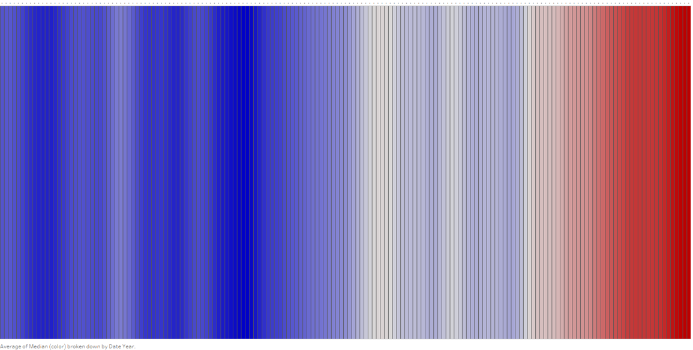

# Visualizing Heat Stripes

The following image was made on **Tableau** with help of the 

**dataset**:HadCRUT.4.6.0.0.annual_ns_avg_smooth

**Sourced from** :https://www.metoffice.gov.uk/hadobs/hadcrut4/data/current/time_series/HadCRUT.4.6.0.0.annual_ns_avg_smooth.txt

